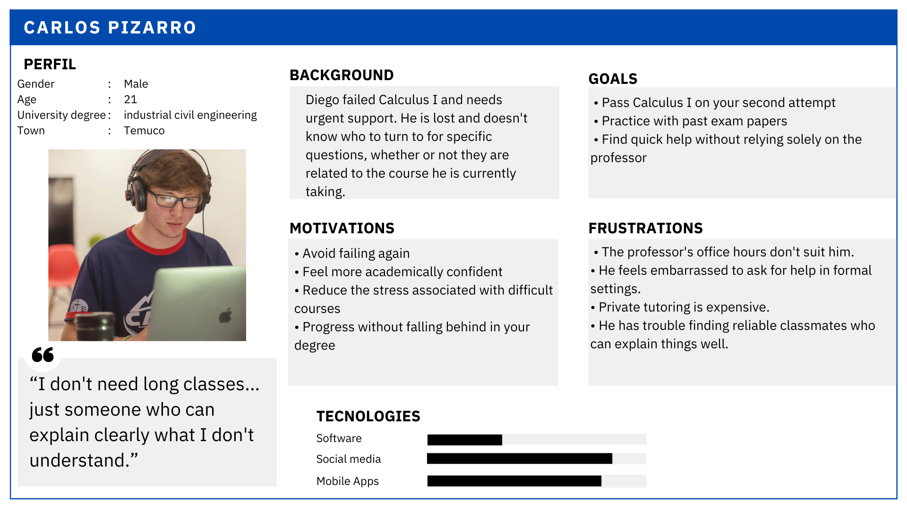
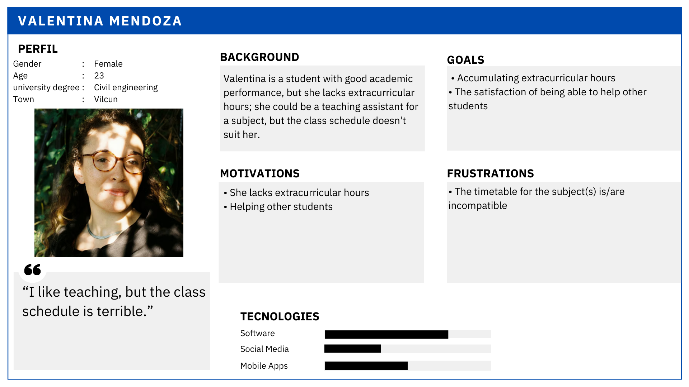
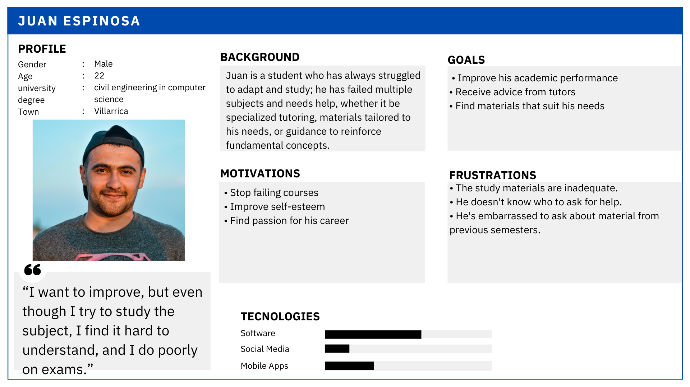
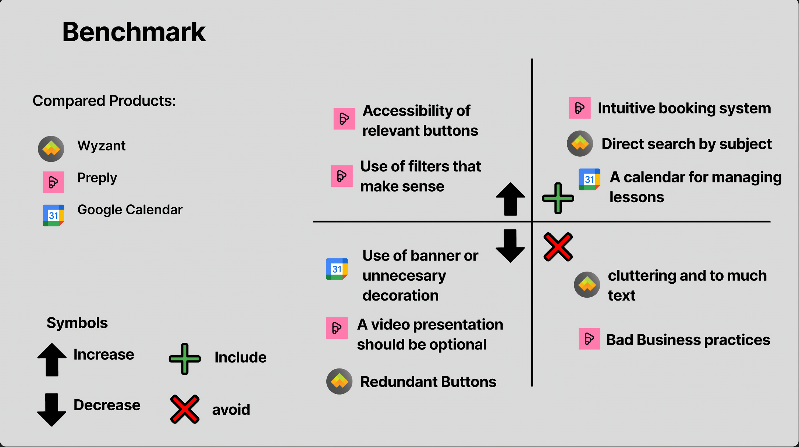
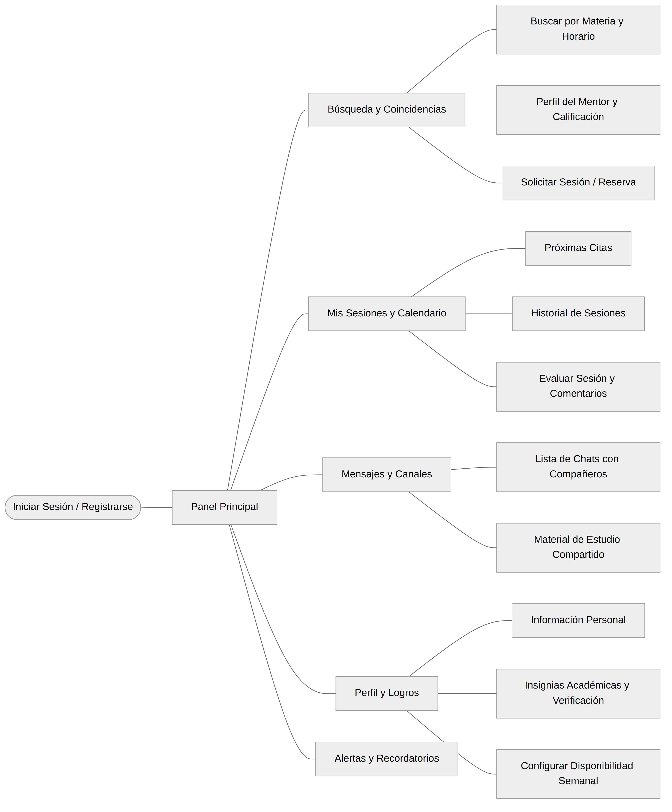

# PeerUp

Peer-to-peer tutoring and mentoring mobile application connecting university students who need academic support with peers who can provide it.

---

## Index

- [1. Introduction](#1-introduction)
  - [1.1 The problem context](#11-the-problem-context)
  - [1.2 The proposed solution](#12-the-proposed-solution)

- [2. Team Members](#2-team-members)

- [3. Strategy Phase](#3-strategy-phase)
  - [3.1 Value Proposition Canvas](#31-value-proposition-canvas)
  - [3.2 UX Persona](#32-ux-persona)
  - [3.3 Benchmarking](#33-benchmarking)

- [4. Scope Phase](#4-scope-phase)

- [5. Structure Phase](#5-structure-phase)
  - [5.1 Navigation Flow](#51-navigation-flow)

- [6. Skeleton Phase](#6-skeleton-phase)

- [7. Surface Phase](#7-surface-phase)

---

## 1. Introduction

### 1.1 The problem context

University students frequently fail or struggle in subjects without knowing where to look for reliable, affordable help. Office hours are limited and schedules often don't align. Private tutoring is expensive and inaccessible, while fellow students with the knowledge and willingness to help lack a structured channel to offer it. This creates a gap between those who need support and those who can provide it.

> *"I want to improve, but even though I try to study the subject, I find it hard to understand, and I do poorly on exams."*

### 1.2 The proposed solution

PeerUp is a mobile application that connects university students seeking academic support with peer mentors from their own institution. Students can search for tutors by subject and schedule, book sessions, communicate directly, and evaluate the experience—all within a single platform.

The service fosters a sense of academic community, lowers the barrier for asking for help, and offers flexible scheduling so that both mentors and mentees can participate on their own terms.

---

## 2. Team Members

- [Hector Becerra] Jefe de Proyecto
- [Matias Gonzales] Diseñador
- [Arturo Rivas] Analista

---

## 3. Strategy Phase

### 3.1 Value Proposition Canvas

A visual representation of what users expect to solve and what the mobile application aims to provide. The main pain points identified are the difficulty of finding affordable, schedule-compatible academic support and the social barrier that prevents students from asking for help in formal settings. PeerUp addresses these by enabling flexible, peer-driven, low-cost tutoring directly from a mobile device.

---

### 3.2 UX Persona

Three user archetypes were defined to capture the full range of needs within the platform:

- The struggling student (mentee)
- The advanced student willing to teach (mentor)
- The student with a mixed profile (both mentee and mentor in different subjects)

#### Struggling student: Carlos Pizarro (21, Temuco)

> *"I don't need long classes… just someone who can explain clearly what I don't understand."*

#### Available mentor: Valentina Mendoza (23, Vilcún)

> *"I like teaching, but the class schedule is terrible."*

#### Struggling student with different background: Juan Espinosa (22, Villarrica)

> *"I want to improve, but even though I try to study the subject, I find it hard to understand, and I do poorly on exams."*

---

### 3.3 Benchmarking

In order to obtain a better visual reference on the design of our product compared to existing applications in this market sector, an informative benchmark was carried out to identify key functionalities and characteristics that could be integrated into our development.

For the benchmark presented below, four applications related to tutoring, scheduling and academic support were considered: **Wyzant**, **Preply**, **RedSalud**, and **AgendaPro**. Aspects such as visual design, information display, accessibility, ease of scheduling, and search functionality were analyzed.

Key insights:
- **Include:** Easy schedule management and direct subject-based search.
- **Increase:** Accessibility of relevant buttons and an overall pleasant interface.
- **Decrease:** Use of unnecessary banners or decorative elements.

---

## 4. Scope Phase

---

## 5. Structure Phase

### 5.1 Navigation Flow

---

## 6. Skeleton Phase

#### 6.1. Low-fidelity wireframes

Low-fidelity wireframes were created to define the prototype's base skeleton. The goal was to distribute information across each screen for three main user flows:

1.  **Tutoring Search and Booking:** Finding tutors by subject, viewing their profiles (availability, ratings), and scheduling a session.
2.  **Session Management:** Managing scheduled tutorials, communicating with the tutor/student, and confirming session completion.
3.  **History View:** Accessing a calendar or list with past and future sessions.

The main screens such as "Home," "Search," "My Tutoring," and "Profile" were also designed, including their corresponding settings.

All the wireframes made in Figma can be viewed at the following link:
[View Wireframes on Figma](https://www.figma.com/design/XMnTTctbPzOS90jXpodItF/Low-Fi---Tutor%C3%ADas?node-id=0-1&p=f&t=2G5IBUMWNHScTkhW-0)

---

## 7. Surface Phase

---

*Course: User Experience Design | 2026*
